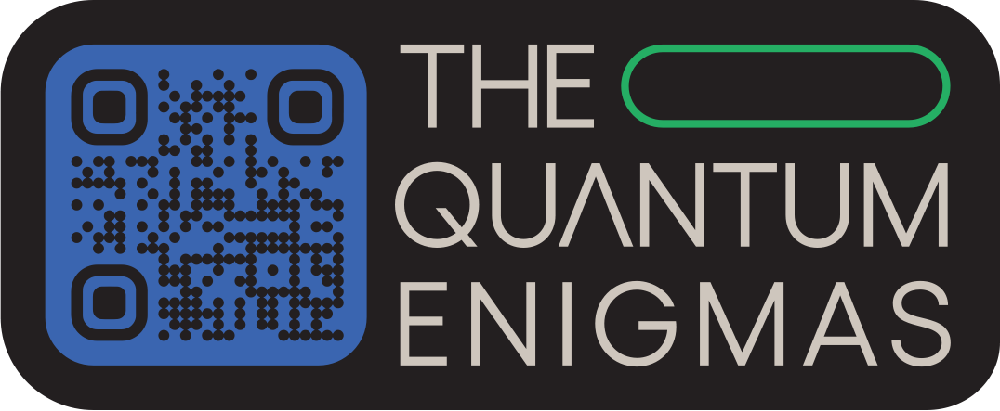

# Quantum Enigmas Problem Sets

The Quantum Enigmas Problem Sets repository compiles a series of exercises to indroduce Quantum computing for everyone.

Access the [Quantum Enigmas](https://www.usherbrooke.ca/iq/quantumenigmas/).

Note that every branding image is subject to copyright.