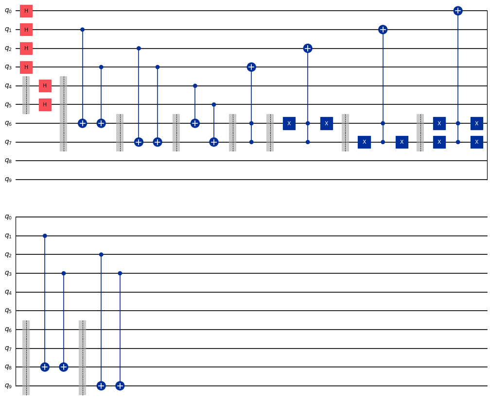
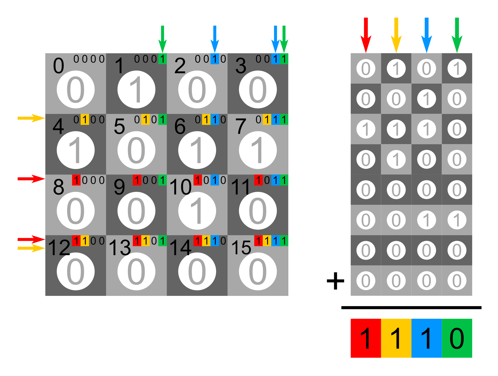
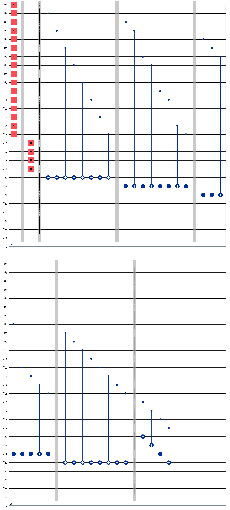
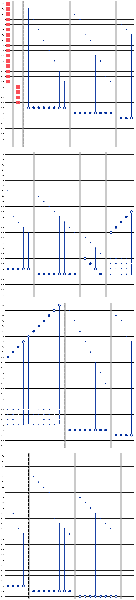

.. meta:: 
    :description: Quantum Enigma 003: The Four-Square Chessboard
    :title: Enigma 003

=======================================
Enigma 003 : The Four-Square Chessboard
=======================================

Alice and Bob continue their journey in space. They are challenged by Aïka, who's hidden a key under one of the four chessboard squares. A coin is then randomly placed on each of the four squares. How will Alice communicate to Bob the exact position of the key by flipping only one coin? You will apply a new concept, the control by the 0-state.

**Make sure to watch the following video before getting started with this problem set:**

.. raw:: html

    <iframe class="embed-responsive-item" width="560" height="315" src="https://www.youtube.com/embed/UuVbtFXOEKQ?rel=0" allowfullscreen="">
    </iframe>

|

.. dropdown:: :material-regular:`error;1.2em;sd-text-warning` Important
    :animate: fade-in
    :color: warning
    
    On this website, you will be able to write and run your own Python code. To do so, you will need to click on the "Activate" button to enable all the code editors and establish a connection to a Kernel. Once clicked, you will see that the Status widget will start to show the connection progress, as well as the connection information. You are ready to write and run your code once you see :code:`Status:Kernel Connected` and :code:`kernel thebe.ipynb status changed to ready[idle]` just below. **Please note that that refreshing the page in any way will cause you to lose all the code that you wrote**. If you run into any issues, please try to reconnect by clicking on the "Activate" button again or reloading the page.

.. raw:: html

    <!-- Configure and load Thebe !-->
    
    

    

.. margin::

    .. dropdown:: :material-regular:`info;1.2em;sd-text-info` Note
        :animate: fade-in
        :color: info
        
        When running your code, you'll know that the code is running if you see :code:`kernel thebe.ipynb status changed to ready[busy]`. If it seems to stay on :code:`ready[idle]` when running your code and/or you're not getting an output when you're supposed to, it most likely means that there's an error in your code. Since the code editor seems to be struggling with outputting error messages, there is no output.

|

Run the cell below to install the necessary packages.

.. raw:: html

    <pre data-executable="true" data-language="python" data-readonly>
    import sys
    !{sys.executable} -m pip install qiskit==1.1.1
    !{sys.executable} -m pip install qiskit_aer==0.14.2
    !{sys.executable} -m pip install pylatexenc==2.10
    </pre>

Now, run the cell below to import the necessary packages.

.. raw:: html

    <pre data-executable="true" data-language="python" data-readonly>
    import numpy as np
    from qiskit import QuantumCircuit, ClassicalRegister, QuantumRegister, transpile
    from qiskit.visualization import plot_histogram
    from qiskit_aer import Aer, AerSimulator
    </pre>

---------------------------
**Problem 1 - Quick quiz**
---------------------------

.. raw:: html

    

    
    

        &times;
        
    

The enigma uses a modulo 2 addition like this one:

.. raw:: html
    
    
    

        

            
                1 0
                +
                0 1
                =
                1 1
            
        

    

Such addition has the interesting characteristic that the numbers can be interchanged in any order like this

.. raw:: html

    

        

            
                1 1
                +
                0 1
                =
                1 0
            
        

    

Or

.. raw:: html

    

        

            
                1 1
                +
                1 0
                =
                0 1
            
        

    

Meaning that adding any two of them gives the third one as an answer (this is true for any numbers). Playing with modulo 2 additions also has other interesting characteristics. In the enigma, adding the first number to the second is done by applying a CNOT between *q*\ :sub:`4`\  and *q*\ :sub:`6`\  (and *q*\ :sub:`5`\  and *q*\ :sub:`7`\). Here is the code of the algorithm in the enigma. 

.. code:: python

    #qubits 0 to 3 are the 4 squares
    #qubits 4 and 5 is where the key is hidden
    #qubits 6 and 7 is where the focus first lands
    #qubits 8 and 9 is where the focus lands at the end which is the key location
    problem1_qc = QuantumCircuit(10)

    #coin distribution on each square
    for i in range(4):
        problem1_qc.h(i)

    problem1_qc.barrier([4,5])

    #hiding the key under one of the 4 squares
    problem1_qc.h(4)
    problem1_qc.h(5)

    problem1_qc.barrier([4,5,6,7])

    #finding the parity of 1's on squares for which binary numbers finish by 1 and putting the answer on q5
    problem1_qc.cx(1, 6)
    problem1_qc.cx(3, 6)
    problem1_qc.barrier([6,7])

    #finding the parity of 1's on squares for which binary numbers have a 1 as second to last digit and putting the answer on q6
    problem1_qc.cx(2, 7)
    problem1_qc.cx(3, 7)
    problem1_qc.barrier([6,7])

    #adding modulo 2 the position of the key and the position of the focus
    problem1_qc.cx(4, 6)
    problem1_qc.cx(5, 7)
    problem1_qc.barrier([6,7])

    #turning the right coin
    problem1_qc.ccx(7,6,3)
    problem1_qc.barrier([6,7])
    problem1_qc.x(6)
    problem1_qc.ccx(7,6,2)
    problem1_qc.x(6)
    problem1_qc.barrier([6,7])
    problem1_qc.x(7)
    problem1_qc.ccx(7,6,1)
    problem1_qc.x(7)
    problem1_qc.barrier([6,7])
    problem1_qc.x(6)
    problem1_qc.x(7)
    problem1_qc.ccx(7,6,0)
    problem1_qc.x(7)
    problem1_qc.x(6)
    problem1_qc.barrier([6,7,8,9])

    #finding the parity of 1's on squares for which binary numbers finish by 1 and putting the answer on q8
    problem1_qc.cx(1, 8)
    problem1_qc.cx(3, 8)
    problem1_qc.barrier([6,7,8,9])

    #finding the parity of 1's on squares for which binary numbers have a 1 as second to last digit and putting the answer on q9
    problem1_qc.cx(2, 9)
    problem1_qc.cx(3, 9)

    problem1_qc.draw(output='mpl')

.. raw:: html

    

|

.. raw:: html

    

.. raw:: html

    
<strong>What is the meaning of the values of <em>q</em>6&nbsp;and <em>q</em>7&nbsp;after all the gates in the circuit have been applied?</strong>

    

\

 .. raw:: html

    

    <form id="question1-form">
        

        <button type="submit" class="button-23">Submit Answer</button>
    </form>
    <pre id="log1"></pre>

.. raw:: html

    

----------------------------
**Problem 2 - Code writing**
----------------------------

**Can you write the circuit for a 4 by 4 square chess set until you calculate the position of the piece to turn?**

.. raw:: html

    

    

    <button class="hint-button" onclick="toggleHint('hint1')">Click to reveal HINT 1</button>
    

        Start by drawing a 4 by 4 chess board and number each square from 0 to 15 in decimal and binary numbers starting with the top row.
    

    <button class="hint-button" onclick="toggleHint('hint2')">Click to reveal HINT 2</button>
    

        The trick is now to add (modulo 2) all the squares that end with a 1 and to proceed the same way with all squares that have a 1 on their second bit counting from right to left and so on using four extra squares.
    

    <button class="hint-button" onclick="toggleHint('hint3')">Click to reveal HINT 3</button>
    

        In the following picture, all squares with green numbers must be added modulo 2 and the answer must be placed in the last qubit (<em>q</em>20) of the focus. The same must take place for blue squares with their result on <em>q</em>21, the yellow squares on <em>q</em>22, and the red squares on <em>q</em>23. The zeros and ones on the squares are only there as an example.
        
    

.. raw:: html

    <pre data-executable="true" data-language="python">
    nb_coins = 16
    nb_key = 4
    nb_focus_first = 4
    nb_focus_key = 4
    nb_qubits = nb_coins + nb_key + nb_focus_first + nb_focus_key

    #qubits 0 to 15 are the 16 squares
    #qubits 16 to 19 is where the key is hidden
    #qubits 20 to 23 is where the focus first lands
    #qubits 24 to 27 is where the focus lands at the end which is the key location
    problem2_qc = QuantumCircuit(nb_qubits)

    # The code for this problem is similar to the one in Problem 1, simply longer.
    ### Start your work here ###

    problem2_qc.draw(output='mpl')
    </pre>

.. dropdown:: Click to reveal the answer
    :color: muted
    :icon: eye

    .. code:: python
        
        nb_coins = 16
        nb_key = 4
        nb_focus_first = 4
        nb_focus_key = 4
        nb_qubits = nb_coins + nb_key + nb_focus_first + nb_focus_key

        #qubits 0 to 15 are the 16 squares
        #qubits 16 to 19 is where the key is hidden
        #qubits 20 to 23 is where the focus first lands
        #qubits 24 to 27 is where the focus lands at the end which is the key location
        problem2_qc = QuantumCircuit(nb_qubits)

        #coin distribution on each square
        for i in range(16):
            problem2_qc.h(i)

        problem2_qc.barrier()

        #hiding the key under one of the 16 squares
        for i in range(16, 20):
            problem2_qc.h(i)

        problem2_qc.barrier()

        #finding the parity of 1's on squares for which binary numbers finish by 1 and putting the answer on q20
        problem2_qc.cx(1, 20)
        problem2_qc.cx(3, 20)
        problem2_qc.cx(5, 20)
        problem2_qc.cx(7, 20)
        problem2_qc.cx(9, 20)
        problem2_qc.cx(11, 20)
        problem2_qc.cx(13, 20)
        problem2_qc.cx(15, 20)
        problem2_qc.barrier()

        #finding the parity of 1's on squares for which binary numbers have a 1 as second to last digit and putting the answer on q21
        problem2_qc.cx(2, 21)
        problem2_qc.cx(3, 21)
        problem2_qc.cx(6, 21)
        problem2_qc.cx(7, 21)
        problem2_qc.cx(10, 21)
        problem2_qc.cx(11, 21)
        problem2_qc.cx(14, 21)
        problem2_qc.cx(15, 21)
        problem2_qc.barrier()

        #finding the parity of 1's on squares for which binary numbers have a 1 as their 3rd digit from the right and putting the answer on q22
        problem2_qc.cx(4, 22)
        problem2_qc.cx(5, 22)
        problem2_qc.cx(6, 22)
        problem2_qc.cx(7, 22)
        problem2_qc.cx(12, 22)
        problem2_qc.cx(13, 22)
        problem2_qc.cx(14, 22)
        problem2_qc.cx(15, 22)
        problem2_qc.barrier()

        #finding the parity of 1's on squares for which binary numbers have a 1 as their 4th digit from the right and putting the answer on q23
        problem2_qc.cx(8, 23)
        problem2_qc.cx(9, 23)
        problem2_qc.cx(10, 23)
        problem2_qc.cx(11, 23)
        problem2_qc.cx(12, 23)
        problem2_qc.cx(13, 23)
        problem2_qc.cx(14, 23)
        problem2_qc.cx(15, 23)
        problem2_qc.barrier()

        #adding modulo 2 the position of the key and the position of the focus
        problem2_qc.cx(16, 20)
        problem2_qc.cx(17, 21)
        problem2_qc.cx(18, 22)
        problem2_qc.cx(19, 23)

        problem2_qc.draw(output='mpl')
    
    .. raw:: html

        

----------------------------
**Problem 3 - Code writing**
----------------------------

**Complete the circuit to allow Alice to turn the right coin knowing that the MCX gate is the multi-control X gate.**

To avoid using a lot of X gates to control the 0 state, we can specify the control state of each control qubit.
Here is the way to use the MCX gate if we wanted to have the control-qubits 20, 21, 22, and 23 control the state 1, 1, 1, and 0 respectively, and qubit 14 as the target-qubit:

:code:`problem3_qc.mcx([20, 21, 22, 23], 14, ctrl_state='0111')`.

.. raw:: html

    <pre data-executable="true" data-language="python">
    ctrl_qubits = [20, 21, 22, 23]
    problem3_qc = problem2_qc.copy()
    problem3_qc.barrier()

    # turning the right coin on the bottom row
    problem3_qc.mcx(ctrl_qubits, 15, ctrl_state='1111')

    problem3_qc.mcx(ctrl_qubits, 14, ctrl_state='0111')

    ### Continue writing the code here ###

    problem3_qc.draw(output='mpl')
    </pre>

.. dropdown:: Click to reveal the answer
    :color: muted
    :icon: eye

    .. code:: python

        ctrl_qubits = [20, 21, 22, 23]
        problem3_qc = problem2_qc.copy()
        problem3_qc.barrier()

        #turning the right coin on the bottom row
        problem3_qc.mcx(ctrl_qubits, 15, ctrl_state='1111')

        problem3_qc.mcx(ctrl_qubits, 14, ctrl_state='0111')

        problem3_qc.mcx(ctrl_qubits, 13, ctrl_state='1011')

        problem3_qc.mcx(ctrl_qubits, 12, ctrl_state='0011')

        #turning the right coin on the 3rd row
        problem3_qc.mcx(ctrl_qubits, 11, ctrl_state='1101')

        problem3_qc.mcx(ctrl_qubits, 10, ctrl_state='0101')

        problem3_qc.mcx(ctrl_qubits, 9, ctrl_state='1001')

        problem3_qc.mcx(ctrl_qubits, 8, ctrl_state='0001')

        #turning the right coin on the 2nd row
        problem3_qc.mcx(ctrl_qubits, 7, ctrl_state='1110')

        problem3_qc.mcx(ctrl_qubits, 6, ctrl_state='0110')

        problem3_qc.mcx(ctrl_qubits, 5, ctrl_state='1010')

        problem3_qc.mcx(ctrl_qubits, 4, ctrl_state='0010')

        #turning the right coin on the top row
        problem3_qc.mcx(ctrl_qubits, 3, ctrl_state='1100')

        problem3_qc.mcx(ctrl_qubits, 2, ctrl_state='0100')

        problem3_qc.mcx(ctrl_qubits, 1, ctrl_state='1000')

        problem3_qc.mcx(ctrl_qubits, 0, ctrl_state='0000')

        #now that the right coin has been turned, it is time to put the focus on the square where the key is located
        problem3_qc.barrier()

        #finding the parity of 1's on squares for which binary numbers finish by 1 and putting the answer on q24
        problem3_qc.cx(1, 24)
        problem3_qc.cx(3, 24)
        problem3_qc.cx(5, 24)
        problem3_qc.cx(7, 24)
        problem3_qc.cx(9, 24)
        problem3_qc.cx(11, 24)
        problem3_qc.cx(13, 24)
        problem3_qc.cx(15, 24)
        problem3_qc.barrier()

        #finding the parity of 1's on squares for which binary numbers have a 1 as second to last digit and putting the answer on q25
        problem3_qc.cx(2, 25)
        problem3_qc.cx(3, 25)
        problem3_qc.cx(6, 25)
        problem3_qc.cx(7, 25)
        problem3_qc.cx(10, 25)
        problem3_qc.cx(11, 25)
        problem3_qc.cx(14, 25)
        problem3_qc.cx(15, 25)
        problem3_qc.barrier()

        #finding the parity of 1's on squares for which binary numbers have a 1 as their 3rd digit from the right and putting the answer on q26
        problem3_qc.cx(4, 26)
        problem3_qc.cx(5, 26)
        problem3_qc.cx(6, 26)
        problem3_qc.cx(7, 26)
        problem3_qc.cx(12, 26)
        problem3_qc.cx(13, 26)
        problem3_qc.cx(14, 26)
        problem3_qc.cx(15, 26)
        problem3_qc.barrier()

        #finding the parity of 1's on squares for which binary numbers have a 1 as their 4th digit from the right and putting the answer on q27
        problem3_qc.cx(8, 27)
        problem3_qc.cx(9, 27)
        problem3_qc.cx(10, 27)
        problem3_qc.cx(11, 27)
        problem3_qc.cx(12, 27)
        problem3_qc.cx(13, 27)
        problem3_qc.cx(14, 27)
        problem3_qc.cx(15, 27)

        problem3_qc.draw(output='mpl')

    .. raw:: html

        

|

.. raw:: html

    

    

        
    

    
    

        

    

    