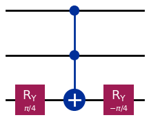
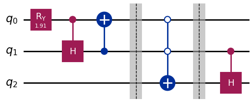
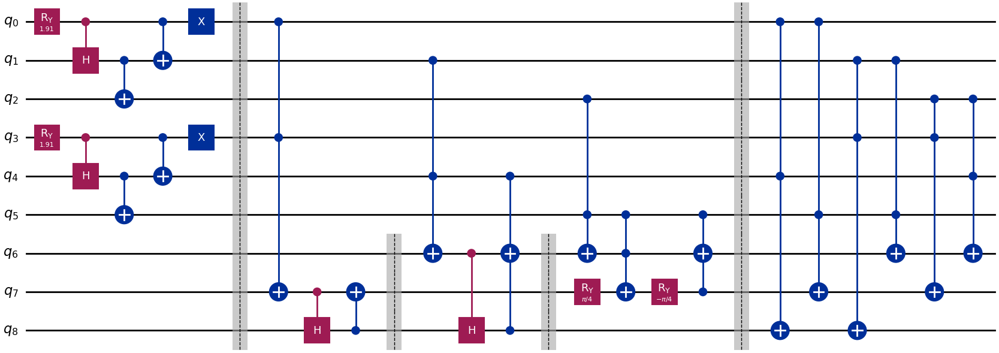
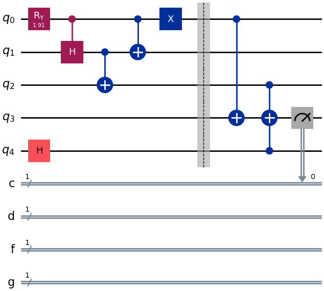
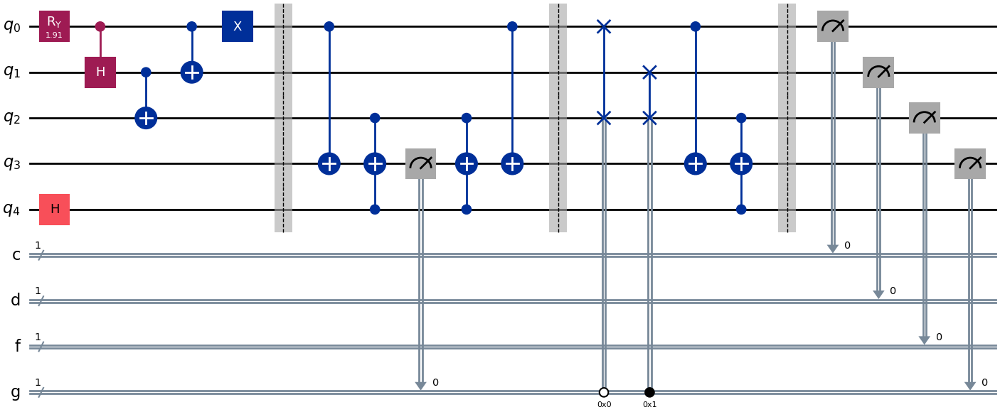

====================================
Enigma 004 : The Monty Hall Exercice
====================================

The diamond you won has disappeared. Your search leads you to Monty Hall Manor, where Kettu has hidden your diamond in one of the three safes in front of you. If you choose the right safe, you can retrieve your diamond, otherwise Kettu will keep it forever. Can you determine the best approach to win to solving this enigma?

**Make sure to watch the following video before getting started with this exercise:**

.. raw:: html

    <iframe class="embed-responsive-item" width="560" height="315" src="https://www.youtube.com/embed/Hd9KhRts1uw?rel=0" allowfullscreen="">
    </iframe>

|

.. dropdown:: :material-regular:`error;1.2em;sd-text-warning` Important
    :animate: fade-in
    :color: warning

    On this website, you will be able to write and run your own Python code. To do so, you will need to click on the "Activate" button to enable all the code editors and establish a connection to a Kernel. Once clicked, you will see that the Status widget will start to show the connection progress, as well as the connection information. You are ready to write and run your code once you see :code:`Status:Kernel Connected` and :code:`kernel thebe.ipynb status changed to ready[idle]` just below. **Please note that that refreshing the page in any way will cause you to lose all the code that you wrote**. If you run into any issues, please try to reconnect by clicking on the "Activate" button again or reloading the page.

.. raw:: html

    <!-- Configure and load Thebe !-->
    
    

.. margin::

    .. dropdown:: :material-regular:`info;1.2em;sd-text-info` Note
        :animate: fade-in
        :color: info

        When running your code, you'll know that the code is running if you see :code:`kernel thebe.ipynb status changed to ready[busy]`. If it seems to stay on :code:`ready[idle]` when running your code and/or you're not getting an output when you're supposed to, it most likely means that there's an error in your code. Since the code editor seems to be struggling with outputting error messages, there is no output.

|

Run the cell below to install the necessary packages.

.. raw:: html

    <pre data-executable="true" data-language="python" data-readonly>
    import sys
    !{sys.executable} -m pip install qiskit==1.1.1
    !{sys.executable} -m pip install qiskit_aer==0.14.2
    !{sys.executable} -m pip install pylatexenc==2.10

    # Import necessary modules
    import numpy as np
    from qiskit import QuantumCircuit
    </pre>

------------------------------
**Exercice 1 - Code writing**
------------------------------

.. raw:: html

    

    
    

        &times;
        
    

**Write a circuit that would only use 3 qubits instead of 4 (and still assuming that you initially chose safe number 2) for Enigma 004 - The Monty Hall Exercice.**

.. raw:: html

    

    

    <button class="hint-button" onclick="toggleHint('q1_hint1')">Click to reveal HINT 1</button>
    

        Use only two qubits to represent the three safes.
    

    <button class="hint-button" onclick="toggleHint('q1_hint2')">Click to reveal HINT 2</button>
    

        Find a way to obtain 1&frasl;3 probability of measuring 00, 01, and 10 (the binary equivalent of 0, 1, and 2).
    

|

.. raw:: html

    <pre data-executable="true" data-language="python">
    problem1_qc = QuantumCircuit(3)

    ### Start your work here ###

    problem1_qc.draw("mpl")
    </pre>

.. dropdown:: Click to reveal the answer
    :color: muted
    :icon: eye

    .. code:: python

        problem1_qc = QuantumCircuit(3)

        prob_2on3 = 2 * np.arcsin(np.sqrt(2/3))
        #Placing the diamond with 1/3 probability for each measure of 00, 01, and 10.
        problem1_qc.ry(prob_2on3, 0)
        problem1_qc.ch(0, 1)
        problem1_qc.cx(1, 0)
        problem1_qc.barrier()

        #Opening safe 1 if the diamond is in safe 0
        problem1_qc.mcx([0, 1], 2, ctrl_state='00')
        problem1_qc.barrier()

        #Opening safe 0 or 1 if the diamond is in safe 2
        problem1_qc.ch(1, 2)

        problem1_qc.draw("mpl")

    .. raw:: html

        

------------------------------
**Exercice 2 - Code writing**
------------------------------

**Write a circuit (using three qubits to hide the diamond exactly like in the enigma) that would randomly determine the chest you choose at the start, and also determine which safe will be opened.**

You can use the following circuit that is the equivalent of a multicontrolled Hadamard gate:

.. code:: python

    problem2_qc.ry(np.pi/4, 2)
    problem2_qc.mcx([0, 1], 2)
    problem2_qc.ry(-np.pi/4, 2)

.. raw:: html

    

|

.. raw:: html

    <button class="hint-button" onclick="toggleHint('q2_hint1')">Click to reveal HINT 1</button>
    

        You can use <em>q</em>3, <em>q</em>4, and <em>q</em>5 to determine the safe you put your hand on at first and <em>q</em>6, <em>q</em>7, and <em>q</em>8 to determine which safe will be opened (safe 0 is linked to <em>q</em>0, <em>q</em>3, and <em>q</em>6; safe 1 is linked to <em>q</em>1, <em>q</em>4, and <em>q</em>7; safe 2 is linked to <em>q</em>2, <em>q</em>5, and <em>q</em>8).
    

    <button class="hint-button" onclick="toggleHint('q2_hint2')">Click to reveal HINT 2</button>
    

        The circuit to randomly choose the safe you put your hand on at the start is the same as the one used to hide the diamond.
    

    <button class="hint-button" onclick="toggleHint('q2_hint3')">Click to reveal HINT 3</button>
    

        For the circuit to determine which safe will be opened, start with the three cases where the diamond and your hand are on the same safe.
    

.. raw:: html

    <pre data-executable="true" data-language="python">
    problem2_qc = QuantumCircuit(9)
    prob_2on3 = 2 * np.arcsin(np.sqrt(2/3))

    ### Start your work here ###

    problem2_qc.draw("mpl")
    </pre>

.. dropdown:: Click to reveal the answer
    :color: muted
    :icon: eye

    .. code:: python

        problem2_qc = QuantumCircuit(9)

        #hiding the diamond in one of the three safes
        prob_2on3 = 2 * np.arcsin(np.sqrt(2/3))
        problem2_qc.ry(prob_2on3, 0)
        problem2_qc.ch(0, 1)
        problem2_qc.cx(1, 2)
        problem2_qc.cx(0, 1)
        problem2_qc.x(0)

        #choosing one of the three safes
        problem2_qc.ry(prob_2on3, 3)
        problem2_qc.ch(3, 4)
        problem2_qc.cx(4, 5)
        problem2_qc.cx(3, 4)
        problem2_qc.x(3)
        problem2_qc.barrier()

        #door to open in case the diamond and your hand are on safe 0
        problem2_qc.mcx([0, 3], 7)
        problem2_qc.ch(7, 8)
        problem2_qc.cx(8, 7)
        problem2_qc.barrier(6, 7, 8)

        #door to open in case the diamond and your hand are on safe 1
        problem2_qc.mcx([1, 4], 6)
        problem2_qc.ch(6, 8)
        """
        we must use an extra control on q1 or q4 for the case
        q8 is in the 1 state to avoid carelessly changing the state of q6
        """
        problem2_qc.mcx([4, 8], 6)
        problem2_qc.barrier(6, 7, 8)

        #door to open in case the diamond and your hand are on safe 2
        problem2_qc.mcx([2, 5], 6)
        problem2_qc.ry(np.pi/4, 7)
        """
        we must use an extra control on q2 or q5 for the case
        q6 is in the 1 state to avoid carelessly changing the state of q7
        """
        problem2_qc.mcx([5, 6], 7)
        problem2_qc.ry(-np.pi/4, 7)
        """
        we must use an extra control on q2 or q5 for the case
        q7 is in the 1 state to avoid carelessly changing the state of q6
        """
        problem2_qc.mcx([5, 7], 6)
        problem2_qc.barrier()

        #door to open in case the diamond is in safe 0 and your hand are on safe 1
        problem2_qc.mcx([0, 4], 8)
        #door to open in case the diamond is in safe 0 and your hand are on safe 2
        problem2_qc.mcx([0, 5], 7)
        #door to open in case the diamond is in safe 1 and your hand are on safe 0
        problem2_qc.mcx([1, 3], 8)
        #door to open in case the diamond is in safe 1 and your hand are on safe 2
        problem2_qc.mcx([1, 5], 6)
        #door to open in case the diamond is in safe 2 and your hand are on safe 0
        problem2_qc.mcx([2, 3], 7)
        #door to open in case the diamond is in safe 2 and your hand are on safe 1
        problem2_qc.mcx([2, 4], 6)

        problem2_qc.draw("mpl")

    .. raw:: html

        

------------------------------
**Exercice 3 - Code writing**
------------------------------

.. raw:: html

    
<em>Time travel</em>

One very important aspect of quantim computing is that all quantum logic gates have an inverse. This means that it is possible to simulate time traveling by going to the end of an algorithm and coming back at the start simply using the inverse of every gate in a backward manner.

The following circuit shows the algorithm seen in the video with an extra qubit used for deciding which door will be opened in the case the diamond is in safe 2 at the beginning **(and assuming that you initially chose safe 2)**. The circuit has been written up to the point in time a safe has been opened by Kettu.

.. code:: python

    qreg_q = QuantumRegister(5, 'q')
    creg_c = ClassicalRegister(1, 'c')
    creg_d = ClassicalRegister(1, 'd')
    creg_f = ClassicalRegister(1, 'f')
    creg_g = ClassicalRegister(1, 'g')
    problem3_qc = QuantumCircuit(qreg_q, creg_c, creg_d, creg_f, creg_g)
    prob_2on3 = 2 * np.arcsin(np.sqrt(2/3))

    problem3_qc.ry(prob_2on3, 0)
    """"
    ## q4 is used to decide which door will be opened in case
       the diamond is in safe 2 at the beginning.
    ## This is necessary since we don't want this information to be lost
       when measuring q3 again after going back in time.
    """
    problem3_qc.h(4)
    problem3_qc.ch(0, 1)
    problem3_qc.cx(1, 2)
    problem3_qc.cx(0, 1)
    problem3_qc.x(0)
    problem3_qc.barrier()
    problem3_qc.cx(0, 3)
    problem3_qc.mcx([2, 4], 3)
    problem3_qc.measure(3, 0)

    problem3_qc.draw("mpl")

.. raw:: html

    

|

**Write the rest of the algorithm to travel in time going back to the beginning, choosing a strategy that will allow you to proceed with the rest of the algorithm and win the diamond everytime.**

.. raw:: html

    

    <button class="hint-button" onclick="toggleHint('q3_hint1')">Click to reveal HINT 1</button>
    

        Place the gates in reverse order upto the barrier and choose a safe the diamond is not in.
    

    <button class="hint-button" onclick="toggleHint('q3_hint2')">Click to reveal HINT 2</button>
    

        Use conditional swap to make sure you choose a safe the diamond is not in. For example, here is how you would apply a NOT gate on <em>q</em>0 with the condition that the classical register g has the value 1: <code class=code-inline>problem3_qc.x(0).c_if(creg_g, 1)</code>
    

.. raw:: html

    <pre data-executable="true" data-language="python">
    qreg_q = QuantumRegister(5, 'q')
    creg_c = ClassicalRegister(1, 'c')
    creg_d = ClassicalRegister(1, 'd')
    creg_f = ClassicalRegister(1, 'f')
    creg_g = ClassicalRegister(1, 'g')
    problem3_qc = QuantumCircuit(qreg_q, creg_c, creg_d, creg_f, creg_g)

    prob_2on3 = 2 * np.arcsin(np.sqrt(2/3))
    problem3_qc.ry(prob_2on3, 0)
    problem3_qc.h(4)
    problem3_qc.ch(0, 1)
    problem3_qc.cx(1, 2)
    problem3_qc.cx(0, 1)
    problem3_qc.x(0)
    problem3_qc.barrier()
    problem3_qc.cx(0, 3)
    problem3_qc.mcx([2, 4], 3)
    problem3_qc.measure(3, creg_g[0])

    ### Start your work here ###

    problem3_qc.barrier()
    problem3_qc.measure(0, creg_c[0])
    problem3_qc.measure(1, creg_d[0])
    problem3_qc.measure(2, creg_f[0])
    problem3_qc.measure(3, creg_g[0])

    problem3_qc.draw("mpl")
    </pre>

.. dropdown:: Click to reveal the answer
    :color: muted
    :icon: eye

    .. code:: python

        qreg_q = QuantumRegister(5, 'q')
        creg_c = ClassicalRegister(1, 'c')
        creg_d = ClassicalRegister(1, 'd')
        creg_f = ClassicalRegister(1, 'f')
        creg_g = ClassicalRegister(1, 'g')
        problem3_qc = QuantumCircuit(qreg_q, creg_c, creg_d, creg_f, creg_g)

        prob_2on3 = 2 * np.arcsin(np.sqrt(2/3))
        problem3_qc.ry(prob_2on3, 0)
        problem3_qc.h(4)
        problem3_qc.ch(0, 1)
        problem3_qc.cx(1, 2)
        problem3_qc.cx(0, 1)
        problem3_qc.x(0)
        problem3_qc.barrier()
        problem3_qc.cx(0, 3)
        problem3_qc.mcx([2, 4], 3)
        problem3_qc.measure(3, creg_g[0])

        problem3_qc.mcx([2, 4], 3)
        problem3_qc.cx(0, 3)
        problem3_qc.barrier()
        problem3_qc.swap(0, 2).c_if(creg_g, 0)
        problem3_qc.swap(1, 2).c_if(creg_g, 1)
        problem3_qc.cx(0, 3)
        problem3_qc.mcx([2, 4], 3)

        problem3_qc.barrier()
        problem3_qc.measure(0, creg_c[0])
        problem3_qc.measure(1, creg_d[0])
        problem3_qc.measure(2, creg_f[0])
        problem3_qc.measure(3, creg_g[0])

        problem3_qc.draw("mpl")

    .. raw:: html

        

----------------------------
**Exercice 4 - Quick quiz**
----------------------------

Let's run the time travel circuit on a simulator to see the results. Run the cell below.

.. raw:: html

    <pre data-executable="true" data-language="python">
    # Time travel circuit
    qreg_q = QuantumRegister(5, 'q')
    creg_c = ClassicalRegister(1, 'c')
    creg_d = ClassicalRegister(1, 'd')
    creg_f = ClassicalRegister(1, 'f')
    creg_g = ClassicalRegister(1, 'g')
    problem3_qc = QuantumCircuit(qreg_q, creg_c, creg_d, creg_f, creg_g)

    prob_2on3 = 2 * np.arcsin(np.sqrt(2/3))
    problem3_qc.ry(prob_2on3, 0)
    problem3_qc.h(4)
    problem3_qc.ch(0, 1)
    problem3_qc.cx(1, 2)
    problem3_qc.cx(0, 1)
    problem3_qc.x(0)
    problem3_qc.barrier()
    problem3_qc.cx(0, 3)
    problem3_qc.mcx([2, 4], 3)
    problem3_qc.measure(3, creg_g[0])

    problem3_qc.mcx([2, 4], 3)
    problem3_qc.cx(0, 3)
    problem3_qc.barrier()
    problem3_qc.swap(0, 2).c_if(creg_g, 0)
    problem3_qc.swap(1, 2).c_if(creg_g, 1)
    problem3_qc.cx(0, 3)
    problem3_qc.mcx([2, 4], 3)

    problem3_qc.barrier()
    problem3_qc.measure(0, creg_c[0])
    problem3_qc.measure(1, creg_d[0])
    problem3_qc.measure(2, creg_f[0])
    problem3_qc.measure(3, creg_g[0])

    # Executing the circuit on a simulator
    simulator = AerSimulator()
    result = simulator.run(transpile(problem3_qc, simulator), shots=1000).result()
    counts = result.get_counts(problem3_qc)
    plot_histogram(counts)
    </pre>

.. raw:: html

    

**What is the meaning of the result?**

 .. raw:: html

    

    <form id="question1-form">
        

        <button type="submit" class="button-23">Submit Answer</button>
    </form>
    <pre id="log1"></pre>

.. raw:: html

    

|

.. raw:: html

    

    

        
    

    
    

        

        

    

    